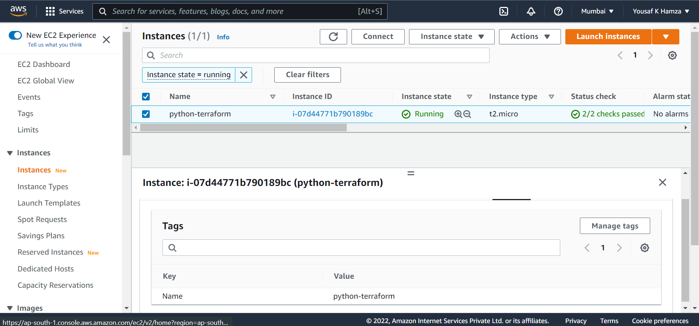
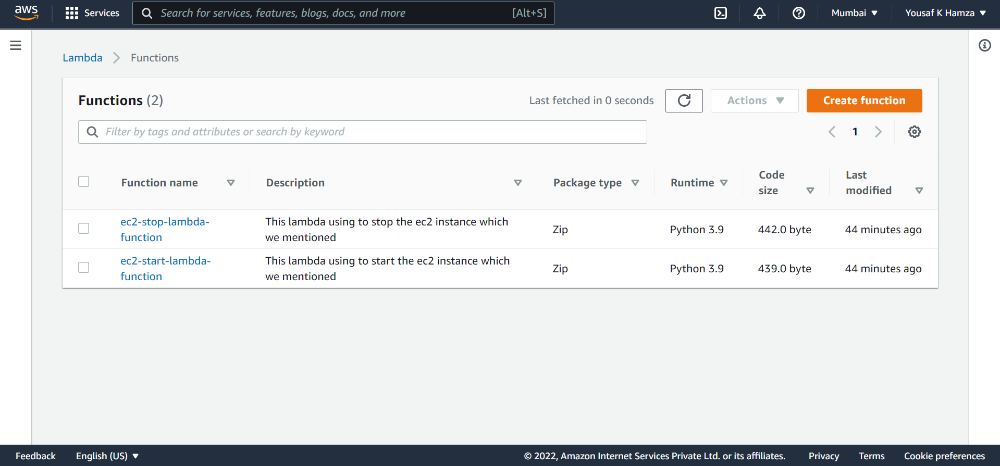
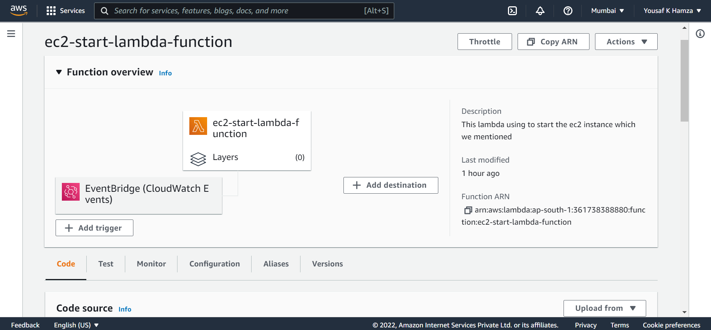

# AWS-Lambda-Coast-Optimization-with-Terraform

[](https://travis-ci.org/joemccann/dillinger)

---
## Description
This is a terraform script for coast optimization using with lambda. So, this script can setup a cron(schedule) to start and stop ec2 servers. So, if we need work a server like office time like 9:00 AM to 7:00 PM so we can save our time for start and stop.

----
## Feature
- We can save billing 
- Automated with CloudWatch

----
## Services Created

- EC2
- Security Group
- IAM Role (Custom inline policies)
- Lambda Function
- Cloudwatch Trigger

----
## Pre-Requests
- Terraform
- Git

#### Terraform Installation
[Terraform Installation from official](https://www.terraform.io/downloads)
_Terrafom Installation from my script_
```
curl -Ls https://raw.githubusercontent.com/yousafkhamza/Terraform_installation/main/terraform.sh | bash
```

#### Pre-Requests (for RedHat-based-Linux)
```
yum install -y git
```

#### Pre-Requests (for Debian-based-Linux)
````
apt install -y git
````

#### Pre-Requests (for Termux-based-Linux)
````
pkg upgrade
pkg install git
````

---
## How to Get
```
git clone https://github.com/yousafkhamza/AWS-Lambda-Coast-Optimization-with-Terraform.git
cd AWS-Lambda-Coast-Optimization-with-Terraform.git
```

----
## How to execute
```
terraform init
terraform plan
terraform apply
```

----
## Output be like
```
 terraform apply -auto-approve

Terraform used the selected providers to generate the following execution plan. Resource actions are indicated with the following
symbols:
  + create

Terraform will perform the following actions:

  # aws_cloudwatch_event_rule.trigger_to_start_ec2_instance will be created
  + resource "aws_cloudwatch_event_rule" "trigger_to_start_ec2_instance" {
      + arn                 = (known after apply)
      + description         = "Trigger that moving data lambda"
      + event_bus_name      = "default"
      + id                  = (known after apply)
      + is_enabled          = true
      + name                = "Trigger-start-ec2-instance-lambda"
      + name_prefix         = (known after apply)
      + schedule_expression = "cron(0 8 * * ? *)"
      + tags                = {
          + "Name" = "ec2 start cloudwatch trigger"
        }
      + tags_all            = {
          + "Name" = "ec2 start cloudwatch trigger"
        }
    }

  # aws_cloudwatch_event_rule.trigger_to_stop_ec2_instance will be created
  + resource "aws_cloudwatch_event_rule" "trigger_to_stop_ec2_instance" {
      + arn                 = (known after apply)
      + description         = "Trigger that moving data lambda"
      + event_bus_name      = "default"
      + id                  = (known after apply)
      + is_enabled          = true
      + name                = "Trigger-stop-ec2-instance-lambda"
      + name_prefix         = (known after apply)
      + schedule_expression = "cron(0 16 * * ? *)"
      + tags                = {
          + "Name" = "ec2 stop cloudwatch trigger"
        }
      + tags_all            = {
          + "Name" = "ec2 stop cloudwatch trigger"
        }
    }

  # aws_cloudwatch_event_target.send_to_start_lambda_target will be created
  + resource "aws_cloudwatch_event_target" "send_to_start_lambda_target" {
      + arn            = (known after apply)
      + event_bus_name = "default"
      + id             = (known after apply)
      + rule           = "Trigger-start-ec2-instance-lambda"
      + target_id      = "SendToLambda"
    }

  # aws_cloudwatch_event_target.send_to_stop_lambda_target will be created
  + resource "aws_cloudwatch_event_target" "send_to_stop_lambda_target" {
      + arn            = (known after apply)
      + event_bus_name = "default"
      + id             = (known after apply)
      + rule           = "Trigger-stop-ec2-instance-lambda"
      + target_id      = "SendToLambda"
    }

  # aws_iam_role.lambda_iam_role_terraform will be created
  + resource "aws_iam_role" "lambda_iam_role_terraform" {
      + arn                   = (known after apply)
      + assume_role_policy    = jsonencode(
            {
              + Statement = [
                  + {
                      + Action    = "sts:AssumeRole"
                      + Effect    = "Allow"
                      + Principal = {
                          + Service = "lambda.amazonaws.com"
                        }
                      + Sid       = ""
                    },
                ]
              + Version   = "2012-10-17"
            }
        )
      + create_date           = (known after apply)
      + description           = "IAM role for lambda to stop start that instance which we created"
      + force_detach_policies = false
      + id                    = (known after apply)
      + managed_policy_arns   = (known after apply)
      + max_session_duration  = 3600
      + name                  = "Lambda-IAM-Role-For-EC2-Stop-Start"
      + name_prefix           = (known after apply)
      + path                  = "/lambda/"
      + tags_all              = (known after apply)
      + unique_id             = (known after apply)

      + inline_policy {
          + name   = "EC2-Describe-Inline-Policy"
          + policy = jsonencode(
                {
                  + Statement = [
                      + {
                          + Action   = "ec2:DescribeInstances"
                          + Effect   = "Allow"
                          + Resource = "*"
                          + Sid      = ""
                        },
                    ]
                  + Version   = "2012-10-17"
                }
            )
        }
      + inline_policy {
          + name   = "EC2-Stop-Start-Inline-Policy"
          + policy = jsonencode(
                {
                  + Statement = [
                      + {
                          + Action   = [
                              + "ec2:StopInstances",
                              + "ec2:StartInstances",
                            ]
                          + Effect   = "Allow"
                          + Resource = "arn:aws:ec2:ap-south-1:361738388880:instance/*"
                          + Sid      = ""
                        },
                    ]
                  + Version   = "2012-10-17"
                }
            )
        }
    }

  # aws_instance.ec2_instance will be created
  + resource "aws_instance" "ec2_instance" {
      + ami                                  = "ami-0dafa01c8100180f8"
      + arn                                  = (known after apply)
      + associate_public_ip_address          = true
      + availability_zone                    = "ap-south-1a"
      + cpu_core_count                       = (known after apply)
      + cpu_threads_per_core                 = (known after apply)
      + disable_api_termination              = (known after apply)
      + ebs_optimized                        = (known after apply)
      + get_password_data                    = false
      + host_id                              = (known after apply)
      + id                                   = (known after apply)
      + instance_initiated_shutdown_behavior = (known after apply)
      + instance_state                       = (known after apply)
      + instance_type                        = "t2.micro"
      + ipv6_address_count                   = (known after apply)
      + ipv6_addresses                       = (known after apply)
      + key_name                             = (known after apply)
      + monitoring                           = (known after apply)
      + outpost_arn                          = (known after apply)
      + password_data                        = (known after apply)
      + placement_group                      = (known after apply)
      + placement_partition_number           = (known after apply)
      + primary_network_interface_id         = (known after apply)
      + private_dns                          = (known after apply)
      + private_ip                           = (known after apply)
      + public_dns                           = (known after apply)
      + public_ip                            = (known after apply)
      + secondary_private_ips                = (known after apply)
      + security_groups                      = (known after apply)
      + source_dest_check                    = true
      + subnet_id                            = "subnet-0ee7a1d09074c3e0b"
      + tags                                 = {
          + "Name" = "python-terraform"
        }
      + tags_all                             = {
          + "Name" = "python-terraform"
        }
      + tenancy                              = (known after apply)
      + user_data                            = "3f970a9f1a5d611c3764c372fc96f2c681039d94"
      + user_data_base64                     = (known after apply)
      + vpc_security_group_ids               = (known after apply)

      + capacity_reservation_specification {
          + capacity_reservation_preference = (known after apply)

          + capacity_reservation_target {
              + capacity_reservation_id = (known after apply)
            }
        }

      + ebs_block_device {
          + delete_on_termination = (known after apply)
          + device_name           = (known after apply)
          + encrypted             = (known after apply)
          + iops                  = (known after apply)
          + kms_key_id            = (known after apply)
          + snapshot_id           = (known after apply)
          + tags                  = (known after apply)
          + throughput            = (known after apply)
          + volume_id             = (known after apply)
          + volume_size           = (known after apply)
          + volume_type           = (known after apply)
        }

      + enclave_options {
          + enabled = (known after apply)
        }

      + ephemeral_block_device {
          + device_name  = (known after apply)
          + no_device    = (known after apply)
          + virtual_name = (known after apply)
        }

      + metadata_options {
          + http_endpoint               = (known after apply)
          + http_put_response_hop_limit = (known after apply)
          + http_tokens                 = (known after apply)
          + instance_metadata_tags      = (known after apply)
        }

      + network_interface {
          + delete_on_termination = (known after apply)
          + device_index          = (known after apply)
          + network_interface_id  = (known after apply)
        }

      + root_block_device {
          + delete_on_termination = true
          + device_name           = (known after apply)
          + encrypted             = (known after apply)
          + iops                  = (known after apply)
          + kms_key_id            = (known after apply)
          + throughput            = (known after apply)
          + volume_id             = (known after apply)
          + volume_size           = 10
          + volume_type           = "gp2"
        }
    }

  # aws_lambda_function.ec2_start_lambda_function will be created
  + resource "aws_lambda_function" "ec2_start_lambda_function" {
      + architectures                  = (known after apply)
      + arn                            = (known after apply)
      + description                    = "This lambda using to start the ec2 instance which we mentioned"
      + filename                       = "tmp/start-lambda-function.zip"
      + function_name                  = "ec2-start-lambda-function"
      + handler                        = "lambda_function.lambda_handler"
      + id                             = (known after apply)
      + invoke_arn                     = (known after apply)
      + last_modified                  = (known after apply)
      + memory_size                    = 128
      + package_type                   = "Zip"
      + publish                        = false
      + qualified_arn                  = (known after apply)
      + reserved_concurrent_executions = -1
      + role                           = (known after apply)
      + runtime                        = "python3.9"
      + signing_job_arn                = (known after apply)
      + signing_profile_version_arn    = (known after apply)
      + source_code_hash               = (known after apply)
      + source_code_size               = (known after apply)
      + tags                           = {
          + "Name" = "ec2 start lambda function"
        }
      + tags_all                       = {
          + "Name" = "ec2 start lambda function"
        }
      + timeout                        = 60
      + version                        = (known after apply)

      + environment {
          + variables = {
              + "REGION" = "ap-south-1"
              + "TAG"    = "python-terraform"
            }
        }

      + tracing_config {
          + mode = (known after apply)
        }
    }

  # aws_lambda_function.ec2_stop_lambda_function will be created
  + resource "aws_lambda_function" "ec2_stop_lambda_function" {
      + architectures                  = (known after apply)
      + arn                            = (known after apply)
      + description                    = "This lambda using to stop the ec2 instance which we mentioned"
      + filename                       = "tmp/stop-lambda-function.zip"
      + function_name                  = "ec2-stop-lambda-function"
      + handler                        = "lambda_function.lambda_handler"
      + id                             = (known after apply)
      + invoke_arn                     = (known after apply)
      + last_modified                  = (known after apply)
      + memory_size                    = 128
      + package_type                   = "Zip"
      + publish                        = false
      + qualified_arn                  = (known after apply)
      + reserved_concurrent_executions = -1
      + role                           = (known after apply)
      + runtime                        = "python3.9"
      + signing_job_arn                = (known after apply)
      + signing_profile_version_arn    = (known after apply)
      + source_code_hash               = (known after apply)
      + source_code_size               = (known after apply)
      + tags                           = {
          + "Name" = "ec2 stop lambda function"
        }
      + tags_all                       = {
          + "Name" = "ec2 stop lambda function"
        }
      + timeout                        = 60
      + version                        = (known after apply)

      + environment {
          + variables = {
              + "REGION" = "ap-south-1"
              + "TAG"    = "python-terraform"
            }
        }

      + tracing_config {
          + mode = (known after apply)
        }
    }

  # aws_lambda_permission.allow_cloudwatch_to_call_start_lambda will be created
  + resource "aws_lambda_permission" "allow_cloudwatch_to_call_start_lambda" {
      + action        = "lambda:InvokeFunction"
      + function_name = "ec2-start-lambda-function"
      + id            = (known after apply)
      + principal     = "events.amazonaws.com"
      + source_arn    = (known after apply)
      + statement_id  = "AllowExecutionFromCloudWatch"
    }

  # aws_lambda_permission.allow_cloudwatch_to_call_stop_lambda will be created
  + resource "aws_lambda_permission" "allow_cloudwatch_to_call_stop_lambda" {
      + action        = "lambda:InvokeFunction"
      + function_name = "ec2-stop-lambda-function"
      + id            = (known after apply)
      + principal     = "events.amazonaws.com"
      + source_arn    = (known after apply)
      + statement_id  = "AllowExecutionFromCloudWatch"
    }

  # aws_security_group.sg_for_ec2 will be created
  + resource "aws_security_group" "sg_for_ec2" {
      + arn                    = (known after apply)
      + description            = "Allow 80,443,22"
      + egress                 = [
          + {
              + cidr_blocks      = [
                  + "0.0.0.0/0",
                ]
              + description      = ""
              + from_port        = 0
              + ipv6_cidr_blocks = [
                  + "::/0",
                ]
              + prefix_list_ids  = []
              + protocol         = "-1"
              + security_groups  = []
              + self             = false
              + to_port          = 0
            },
        ]
      + id                     = (known after apply)
      + ingress                = [
          + {
              + cidr_blocks      = [
                  + "0.0.0.0/0",
                ]
              + description      = "HTTPS"
              + from_port        = 443
              + ipv6_cidr_blocks = [
                  + "::/0",
                ]
              + prefix_list_ids  = []
              + protocol         = "tcp"
              + security_groups  = []
              + self             = false
              + to_port          = 443
            },
          + {
              + cidr_blocks      = [
                  + "0.0.0.0/0",
                ]
              + description      = "HTTPS"
              + from_port        = 80
              + ipv6_cidr_blocks = [
                  + "::/0",
                ]
              + prefix_list_ids  = []
              + protocol         = "tcp"
              + security_groups  = []
              + self             = false
              + to_port          = 80
            },
          + {
              + cidr_blocks      = [
                  + "0.0.0.0/0",
                ]
              + description      = "SSH"
              + from_port        = 22
              + ipv6_cidr_blocks = [
                  + "::/0",
                ]
              + prefix_list_ids  = []
              + protocol         = "tcp"
              + security_groups  = []
              + self             = false
              + to_port          = 22
            },
        ]
      + name                   = "sgec2"
      + name_prefix            = (known after apply)
      + owner_id               = (known after apply)
      + revoke_rules_on_delete = false
      + tags                   = {
          + "Name" = "sg-for-stop-start-ec2"
        }
      + tags_all               = {
          + "Name" = "sg-for-stop-start-ec2"
        }
      + vpc_id                 = (known after apply)
    }

Plan: 11 to add, 0 to change, 0 to destroy.
aws_iam_role.lambda_iam_role_terraform: Creating...
aws_security_group.sg_for_ec2: Creating...
aws_security_group.sg_for_ec2: Creation complete after 4s [id=sg-01e05ef2f174955f7]
aws_instance.ec2_instance: Creating...
aws_iam_role.lambda_iam_role_terraform: Creation complete after 5s [id=Lambda-IAM-Role-For-EC2-Stop-Start]
aws_lambda_function.ec2_start_lambda_function: Creating...
aws_lambda_function.ec2_stop_lambda_function: Creating...
aws_instance.ec2_instance: Still creating... [10s elapsed]
aws_lambda_function.ec2_start_lambda_function: Still creating... [10s elapsed]
aws_lambda_function.ec2_stop_lambda_function: Still creating... [10s elapsed]
aws_lambda_function.ec2_stop_lambda_function: Creation complete after 11s [id=ec2-stop-lambda-function]
aws_cloudwatch_event_rule.trigger_to_stop_ec2_instance: Creating...
aws_cloudwatch_event_rule.trigger_to_stop_ec2_instance: Creation complete after 1s [id=Trigger-stop-ec2-instance-lambda]
aws_lambda_permission.allow_cloudwatch_to_call_stop_lambda: Creating...
aws_cloudwatch_event_target.send_to_stop_lambda_target: Creating...
aws_cloudwatch_event_target.send_to_stop_lambda_target: Creation complete after 0s [id=Trigger-stop-ec2-instance-lambda-SendToLambda]
aws_lambda_permission.allow_cloudwatch_to_call_stop_lambda: Creation complete after 0s [id=AllowExecutionFromCloudWatch]
aws_lambda_function.ec2_start_lambda_function: Creation complete after 16s [id=ec2-start-lambda-function]
aws_cloudwatch_event_rule.trigger_to_start_ec2_instance: Creating...
aws_cloudwatch_event_rule.trigger_to_start_ec2_instance: Creation complete after 1s [id=Trigger-start-ec2-instance-lambda]
aws_lambda_permission.allow_cloudwatch_to_call_start_lambda: Creating...
aws_cloudwatch_event_target.send_to_start_lambda_target: Creating...
aws_cloudwatch_event_target.send_to_start_lambda_target: Creation complete after 0s [id=Trigger-start-ec2-instance-lambda-SendToLambda]
aws_lambda_permission.allow_cloudwatch_to_call_start_lambda: Creation complete after 0s [id=AllowExecutionFromCloudWatch]
aws_instance.ec2_instance: Still creating... [20s elapsed]
aws_instance.ec2_instance: Still creating... [30s elapsed]
aws_instance.ec2_instance: Creation complete after 33s [id=i-07d44771b790189bc]

Apply complete! Resources: 11 added, 0 changed, 0 destroyed.
```
### _Screenshots_





----
## Behind the code
````

````

----
## Conclusion
This is a simple bash script for clone all the private public repos except forked repos under a github user. I hope this would be helpful to anyone so please let me know if you have any comments.

### ⚙️ Connect with Me 

<p align="center">
<a href="mailto:yousaf.k.hamza@gmail.com"></a>
<a href="https://www.linkedin.com/in/yousafkhamza"></a> 
<a href="https://www.instagram.com/yousafkhamza"></a>
<a href="https://wa.me/%2B917736720639?text=This%20message%20from%20GitHub."></a><br />
